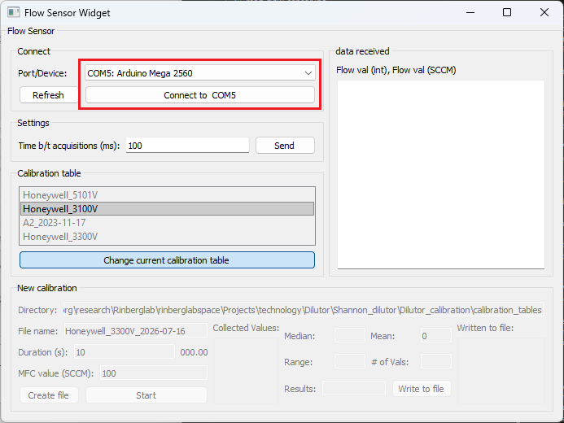
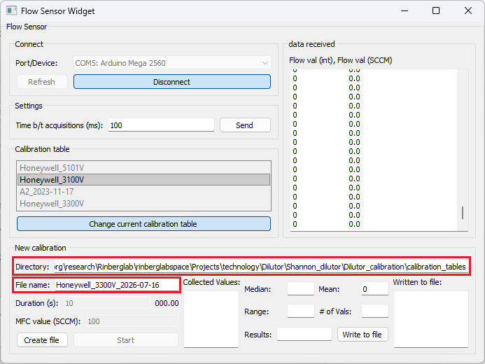
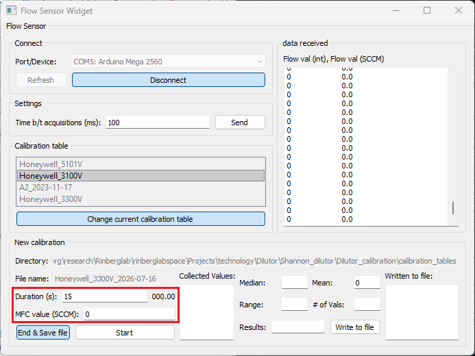
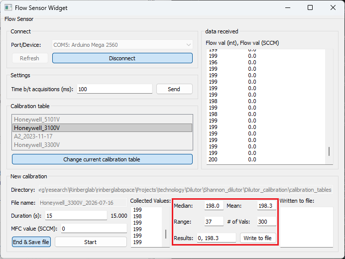

# Calibration procedure

## Hardware setup

### Electronics
- Upload the script to the Arduino
- Connect the flow sensor to the Arduino and a constant 9V power supply. Make sure all 3 are grounded to each other
    - It is essential that the power supply to the flow sensor is stable. The flow sensor output is ratiometric to the supply voltage.

### Hardware
- Connect the flow sensor input to the exhaust line of the final valve
- Turn on the power to the flow sensor. Be sure to give it 1-5 min of warmup time before starting to record.
- Make sure the final valve is closed

## Software setup
<!--Copied from OlfaControl_Electronics/../Flow_Sensor_Calibration_Protocol.md-->

### Create File

1. Open the Flow Sensor GUI. Select the correct device from the dropdown menu and click "Connect".

  

2. Confirm/edit the file directory if needed. Enter the desired file name.

  

3. Click "Create File".

## Calibrate
<!--
***Note:** Calibration tables **must** be in descending order, so it is recommended to start calibrating at the maximum capacity and work down from there. Otherwise, the table will need to be sorted manually after completing the calibration.*
-->

### Olfa MFC calibration
1. Physically set both dilutor MFCs to 0 SCCM.

2. Physically set the main olfa MFC to the first desired calibration value (0). Enter that same value into the "MFC value (SCCM)" box.

3. Enter the desired duration of the calibration. (15 seconds is typically sufficient)

  

4. Click "Start"

5. Once calibration at this flow rate is complete, stats about the flow sensor data collected during that period will populate the fields in the bottom right of the groupbox. By default, the values to write to the calibration files will display in the bottom-right box (*flow rate* [SCCM], *mean value* [integer]).  
---> **Note:** Don't worry about the SCCM flow rate displayed in the "Setpoint" box - this is based on whatever calibration table is currently selected, and is likely inaccurate.  

  

6. **Check if the calibration was successful** by looking at the range of values collected from the flow sensor during the calibration. If the range exceeds 4, repeated trials are recommended.  
---> **Note:** Typically, at a single flow value, I run two 15-second calibrations and save the mean of the second one. If the means of the two calibrations differ by more than 10-ish, I recommend running additional 15-second calibrations until consecutive calibrations have similar values.

7. If the calibration was successful, click the "Write" button to write this pair to the calibration file. If necessary, you can also manually enter the values to write to the file. (Values already written to the file will be displayed in the far right box.)  

8. **Repeat for as many values as desired.** (I typically do 10sccm increments, to save time. For more sensitive experiments, 2-5 increments may be more helpful.)

 

## Once complete:
9. Click "End & Save File"

## Vacuum MFC calibration

10. Physically set the Main olfa MFC to 1000 SCCM
11. (Check that the Air MFC is still set to 0 SCCM)
12. Update the file name to "vacuum_calibration_thisdate" or whatever
13. Repeat steps 2-9 from the Olfa MFC calibration procedure.

## Air MFC calibration

14. Physically set the Main olfa MFC and Vacuum MFCs to 0 SCCM.
15. Update the file name to "air_calibration_thisdate" or whatever
16. Repeat steps 2-9 from the Olfa MFC calibration procedure.

