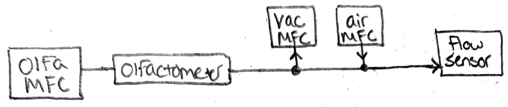

# Dilutor calibration

PyQt5 app for calibrating dilutors using Honeywell 3000/5000 series flow sensors

---

## Overview

### Setup
- Add flow sensor to final valve output (script for flow sensor found [here](docs/Flow_sensor_driver.md))



### Record calibration data
- Record calibration tables for each of the 3 MFCs (main olfa, vacuum, air)
   - For each MFC: set to values (0,50,100,150,...)
   - Record flow sensor reading
   - Create a calibration table of [MFC value, flow sensor reading]


### Analyze calibration data
- Fit a curve to each calibration table

### Implement
- Enter desired dilution value into the python script
- Script will output the values to set the dilutor to (vac & air MFCs) to give the accurate dilution value (based on main olfa MFC as "ground truth")


#### TODO:
Calibration confirmation instructions

---

## Setup

### Hardware Requirements:
- Honeywell 3000/5000 flow sensor
- Arduino/Teensy running `read_flow_sensor.ino`
- 8-9V power supply

### Software Installation:
** Directions for Windows OS only **

1. Open the command prompt
2. Navigate to the directory you want to store these files
   ```bash
   cd <folder_you_want>
   ```
3. Clone this repository & navigate into that folder
   ```bash
   git clone https://github.com/tooles01/Dilutor_calibration.git
   cd Dilutor_calibration
   ```

4. Create & activate a virtual environment
   ```bash
   python -m venv <environment_name>
   environment_name\scripts\activate.bat
   ```

5. Install dependencies
   ```bash
   pip install PyQt5 pyserial numpy pyqtgraph matplotlib
   ```

6. Run the application
   ```bash
   python run_calibration.py
   ```

---

## Calibrating

Follow calibration procedure found [here](docs/Calibration_procedure.md)